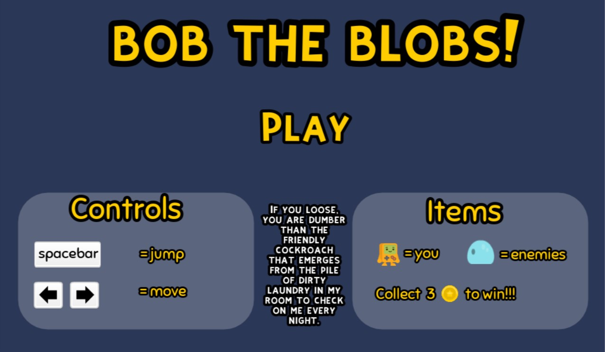

# 2D_platformer

 A 2D PLATFORMER GAME MADE WITH THE GODOT(http://www.godotengine.org) GAME ENGINE.

###############################################################################

	Game assets under Creative Commons License (Creative Commons Zero, CC0)
		http://creativecommons.org/publicdomain/zero/1.0/
		   Assets(tiles and sprites) by Kenney Vleugels (www.kenney.nl)

###############################################################################

